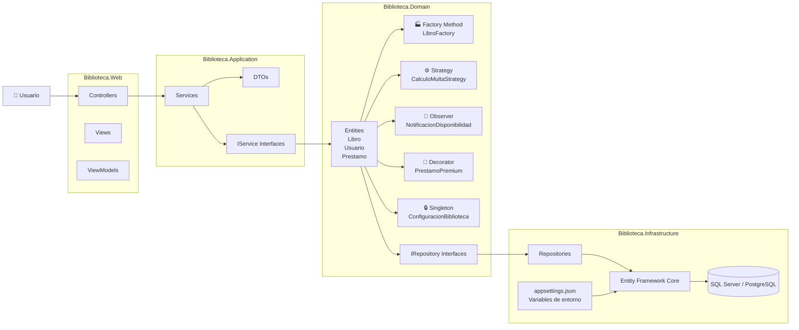

# ADR-05: Deudas técnicas del proyecto Biblioteca

## Deuda técnica #1: Persistencia de datos con almacenamiento local

### ¿Qué es?
Actualmente el sistema de biblioteca almacena la información de libros, usuarios y préstamos utilizando archivos locales o estructuras temporales en memoria, en lugar de utilizar una base de datos.

### ¿Por qué existe?
Esta decisión se tomó para avanzar rápidamente con la implementación inicial del sistema y validar las funcionalidades principales antes de integrar una solución de persistencia más robusta.

### Costo de no pagarla
Si la cantidad de libros, usuarios y préstamos aumenta, el sistema puede presentar problemas de rendimiento, dificultad para realizar búsquedas y riesgo de pérdida de información. Además, sería complicado permitir varios usuarios trabajando al mismo tiempo.

### Propuesta de solución
Migrar la persistencia a una base de datos utilizando Entity Framework Core, implementar el patrón Repository para separar el acceso a datos y mejorar la escalabilidad del sistema.

---

## Deuda técnica #2: Configuración del sistema escrita directamente en el código

### ¿Qué es?
Algunos valores del sistema, como rutas de archivos, parámetros de configuración de préstamos o valores predeterminados, se encuentran definidos directamente dentro del código fuente.

### ¿Por qué existe?
Se implementó de esta manera durante la etapa inicial del desarrollo para reducir el tiempo de configuración y facilitar las pruebas locales.

### Costo de no pagarla
Cambiar configuraciones entre ambientes de desarrollo, pruebas y producción requiere modificar el código manualmente. Esto aumenta el riesgo de errores y dificulta el mantenimiento del sistema.

### Propuesta de solución
Mover la configuración a archivos externos como `appsettings.json` y variables de entorno. Utilizar Dependency Injection para administrar servicios y configuraciones de forma más flexible.

---

## Diagrama

