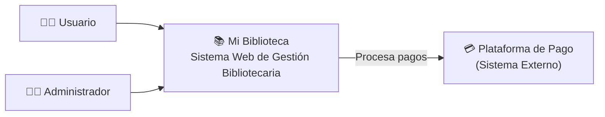
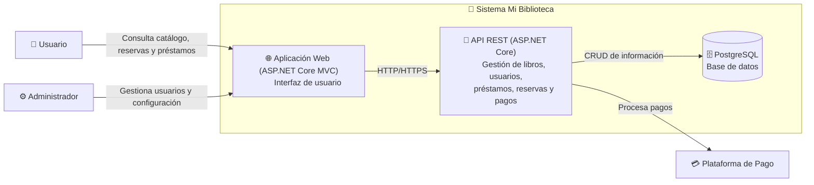

# C4 lvl 1

 Dirigido a: Usuarios, clientes, equipo de trabajo y personas no técnicas. Muestra una visión general del sistema, identificando los usuarios que interactúan con él y los sistemas externos relacionados. Está dirigido a cualquier tipo de audiencia, ya que permite comprender rápidamente el propósito de la aplicación.

# C4 lvl 2

Dirigido a: Equipo técnico y desarrolladores. El diagrama de contenedores muestra la arquitectura principal de Mi Biblioteca y cómo se comunican sus componentes. La aplicación web interactúa con la API REST, la cual procesa la lógica del negocio, gestiona el acceso a la base de datos PostgreSQL y se integra con la plataforma de pagos para procesar las transacciones del sistema.

