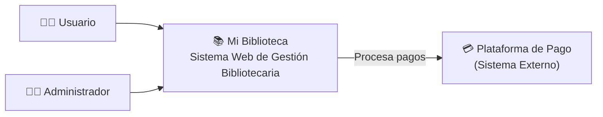

# C4 lvl 1

Muestra una visión general del sistema, identificando los usuarios que interactúan con él y los sistemas externos relacionados. Está dirigido a cualquier tipo de audiencia, ya que permite comprender rápidamente el propósito de la aplicación.
