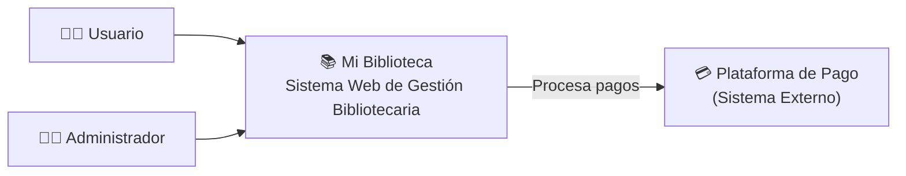
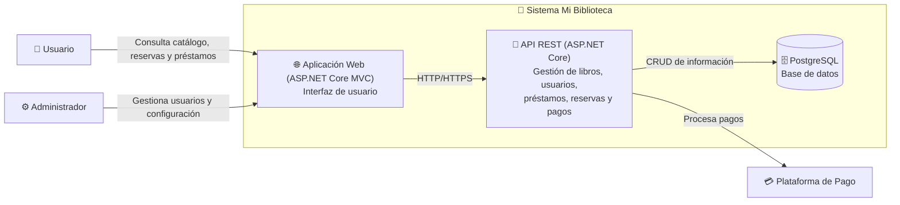
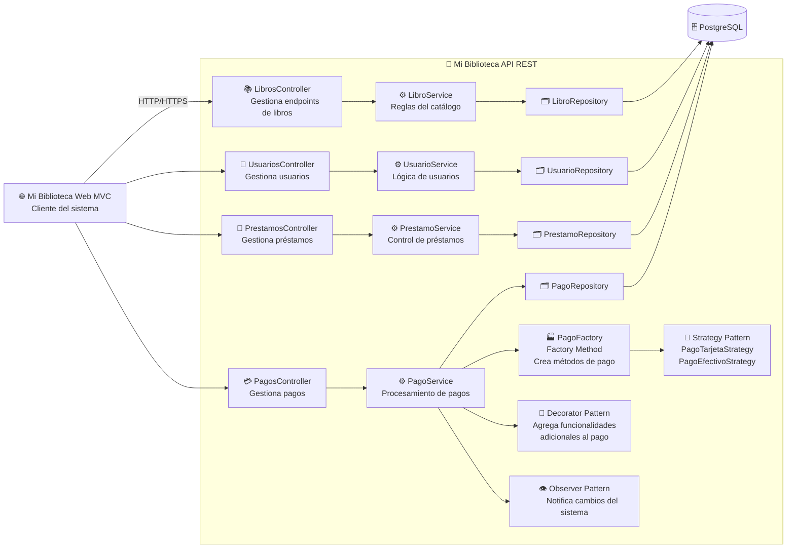

# C4 lvl 1

 Dirigido a: Usuarios, clientes, equipo de trabajo y personas no técnicas. Muestra una visión general del sistema, identificando los usuarios que interactúan con él y los sistemas externos relacionados. Está dirigido a cualquier tipo de audiencia, ya que permite comprender rápidamente el propósito de la aplicación.

# C4 lvl 2

Dirigido a: Equipo técnico y desarrolladores. El diagrama de contenedores muestra la arquitectura principal de Mi Biblioteca y cómo se comunican sus componentes. La aplicación web interactúa con la API REST, la cual procesa la lógica del negocio, gestiona el acceso a la base de datos PostgreSQL y se integra con la plataforma de pagos para procesar las transacciones del sistema.

# C4 lvl 3

Dirigido a: Desarrolladores que necesitan trabajar directamente con la implementación. El diagrama de componentes muestra la estructura interna de la API REST de Mi Biblioteca. Se observan los controladores encargados de recibir solicitudes, los servicios que contienen la lógica del negocio, los repositorios para la gestión de datos y los patrones GoF implementados para mejorar la flexibilidad y mantenibilidad del sistema.

